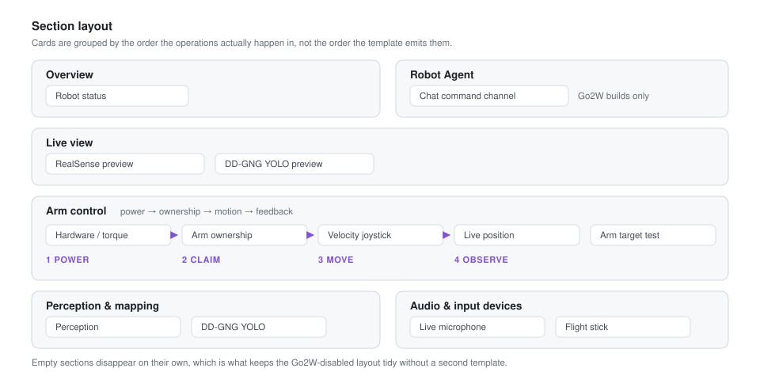
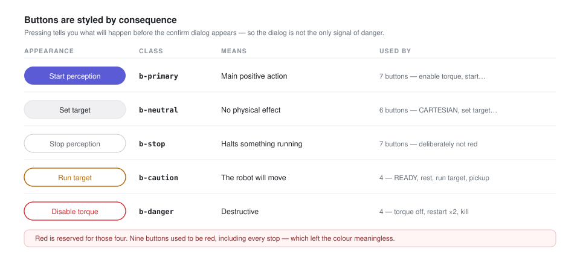
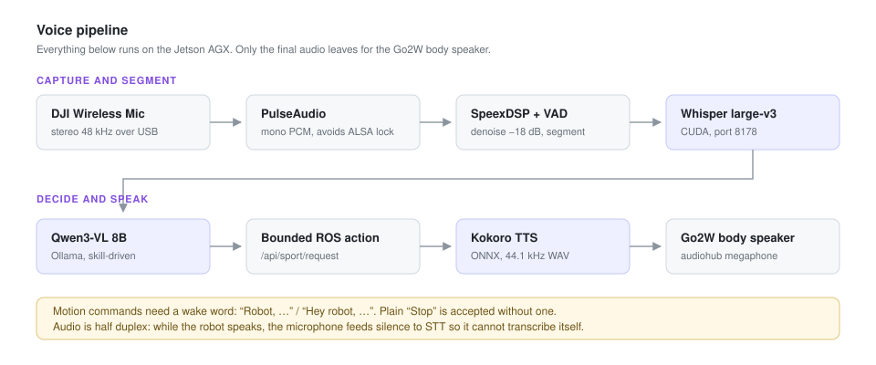

# application_web_monitor

ROS 2 application dashboard for OM6DOF, with optional Unitree Go2W integration.
The application server runs on the Jetson AGX and provides robot
status, forwarded camera/audio, speech-to-text, local LLM actions, teleoperation
controls, and guarded service operations.

The source used by the AGX is:

```text
/home/kublab/ros2_ws/src/go2w_om6dof_agent/application/application_web_monitor
```

Open `http://<agx-ip>:8080` from the trusted robot LAN. The HTTP server binds to
all interfaces and currently has no login, so it must not be exposed directly
to an untrusted network.

## Interface layout



Cards are grouped into sections that follow the operating sequence rather
than the order the template happens to emit them:

| Section | Cards |
|---|---|
| Overview | robot status |
| Robot Agent | chat command channel (Go2W builds only) |
| Live view | RealSense and DD-GNG camera previews |
| Arm control | hardware/torque service, arm ownership, velocity joystick, live position, arm target |
| Perception &amp; mapping | perception controls, DD-GNG YOLO |
| Audio &amp; input devices | microphone pipeline, flight stick |

Inside **Arm control** the order is power, then ownership, then motion, then
feedback, because that is the order the operations must actually happen in.
The velocity joystick and the live position view sit next to each other so
the command and its result can be read together.

Sections with no content disappear on their own, which is what keeps the
Go2W-disabled layout tidy without a second template. Headings form a single
outline: `h1` page, `h2` section, `h3` card, `h4` sub-block.

## Button colours mean consequence



Buttons are styled by what pressing them does, never for decoration:

| Class | Meaning | Appearance |
|---|---|---|
| `b-primary` | the card's main positive action | filled accent |
| `b-neutral` | no physical effect | grey fill |
| `b-stop` | halts something already running | neutral outline |
| `b-caution` | the robot will physically move | amber outline |
| `b-danger` | destructive | red outline |

Red is reserved for the four destructive controls — disable torque, restart
the OM6DOF stack, restart the monitor, kill the monitor — so that red keeps
its meaning. Stop actions are deliberately **not** red; when everything that
halts something is red, red stops being a warning.

The mapping lives in `BUTTON_CLASS_BY_ID` and `BUTTON_CLASS_BY_ACTION` in
`web_monitor.py` and is applied to the finished page by
`style_action_buttons()`. It is keyed on element id first because ids are
stable and the client JS already depends on them: renaming a visible label
therefore cannot silently downgrade a destructive control into an
ordinary-looking one. Buttons that match neither table default to
`b-neutral`.

**When adding a button, add its id to that table in the same change.**

## Light and dark theme

Both palettes ship with the page. It follows the operating system setting by
default, and the header toggle overrides that in either direction; the choice
is stored in `localStorage` under `om6dof-theme`. A short script in `<head>`
applies the stored choice before the first paint, so reloading in dark mode
does not flash white.

The 3D arm viewport stays dark in both themes. Its canvas paints its own
scene from JavaScript, and a dark viewport inside a light application is the
normal convention for 3D views.

## Choosing a controller

Three sources can drive the arm, selected in **Control source** on the arm
ownership card. Only the selected one is ever sent, so two sticks can stay
plugged in without fighting each other:

| Source | Device |
|---|---|
| Web analog | the browser joystick in the dashboard |
| Airbus TCA analog | Thrustmaster T.A320, `/dev/input/js0` here |
| Logitech F710 gamepad | Logitech/Logicool F710 in XInput mode, `js1` here |

Each reader matches its own device by USB product name, so device order does
not matter. The TCA reader still adopts an unrecognised stick — that is what
keeps a TCA reporting an odd firmware name working — but it explicitly skips
anything that looks like a gamepad, so the fallback cannot steal `js1`. The
gamepad reader only ever takes a name match.

### Logitech F710 mapping

The F710 reports 8 axes and 11 buttons in XInput mode, so none of the TCA's
mapping carries over and it gets its own profile:

| Control | Action |
|---|---|
| Left stick | axis pair 1 |
| Right stick | axis pair 2 |
| RT | speed up, toward 200% |
| LT | speed down, toward 15% |
| A | grip |
| B | release |
| Start | toggle REST/READY |

Neither trigger pressed is the tuned rate; the triggers are read as absolute
positions rather than integrated, so the speed never drifts. On the `xpad`
driver they rest at `-1.0` and reach `+1.0`, which is why the code normalises
with `(value + 1) / 2` — a driver that rested at `0.0` instead would need that
changed. Pushing a stick forward drives its axis positive, matching the TCA and
the web joystick.

A **Logitech F710 gamepad** card under *Audio & input devices* mirrors the pad
live, drawn in the physical layout so a control can be found by where the thumb
already is rather than by counting indices: sticks labelled `ANALOG KIRI` and
`ANALOG KANAN`, the D-pad, the A/B/X/Y diamond, LB/RB shoulders, LT/RT bars
that fill as they are squeezed, and Back/Logo/Start down the middle. Clicking a
stick (LS/RS) lights that stick's ring, so all eleven buttons are represented
without a separate list.

The D-pad is lit from axes 7 and 8 rather than from buttons, because that is
how XInput reports it.

Everything is positioned in percentages inside one `aspect-ratio` box, so the
pad scales as a unit and no element can drift outside the body. Stick travel is
a percentage of the stick itself, which is why resizing never needs a
JavaScript change.

The card renders whether or not the pad is the selected control source, so it
doubles as the way to discover which physical button carries which number
before remapping.

The buttons and axes are named at module scope as `PAD_*` in `web_monitor.py`;
remap there. Gripper and REST/READY handling is shared with the TCA through
`_gripper_from_stick` and `_rest_from_stick`, so the guards and the commanded
gripper positions cannot drift apart between the two controllers.

## Thrustmaster TCA flight-stick monitor

When a USB flight stick is connected, the dashboard shows a **Flight stick
input** card. It discovers Linux joystick devices at `/dev/input/js*`, prefers
names containing `Thrustmaster`, `TCA`, or `Airbus`, and displays the held
buttons, last button event, and normalized axis values.

> **This stick commands the arm.** The card is not a passive readout: its axes
> jog the arm and four of its buttons actuate hardware.

| Button | Action | Fires on |
|---|---|---|
| 4 | grip (close) | press edge |
| 3 | release (open) | press edge |
| 8 | toggle REST/READY | press edge |
| 1 / 2 | pitch up / down | held |

The **LIFT lever (axis 4)** is the speed throttle: centre is the tuned rate,
fully up is 200%, fully down is 15%. See [Jog speed](#jog-speed). If it feels
inverted on a particular stick, flip the sign where `SPEED_AXIS_INDEX` is read
in `request_airbus_jog`.

Gripping and releasing are separate buttons on purpose. An earlier mapping
gripped while Button 4 was held and opened the moment it was released, so
anything being carried dropped as soon as a finger lifted. The gripper now
keeps its last commanded state until the opposite button is pressed.

The button numbers are the 1-based ones shown on the card, matching Linux
joystick order. They are defined once as `GRIP_BUTTON`, `RELEASE_BUTTON`,
`REST_BUTTON`, `PITCH_UP_BUTTON`, and `PITCH_DOWN_BUTTON` in `web_monitor.py`;
remap there rather than editing the request handlers. Unlisted buttons are
displayed only.

Every one of these actions requires streaming arm control to be enabled first
and is refused while a pickup, arm target, tracking, or search is running.

The reference hardware is the Thrustmaster TCA Sidestick Airbus Edition.
Vendor manuals, drivers, and the button numbering are at
<https://support.thrustmaster.com/en/product/tca-sidestick-airbus-edition-en/#manual>.

The card is two independent blocks: an analog stage and a plain grid of the 17
buttons. Nothing is positioned on top of anything else, so no control can be
clipped at any card width.

The analog stage reads as follows:

| Element | Axis | Shown as |
|---|---|---|
| Large stick | 1 and 2 | blue knob, `X` on the horizontal crosshair, `Y` on the vertical one |
| Yaw | 3 | amber needle sweeping ±135° around a static track, with a tick marking zero at the top |
| Lift | 4 | purple knob on the vertical bar |
| Small stick | 5 and 6 | green knob inside the nested circle |

Each axis label sits on the axis it names. Laying `X` and `Y` side by side
would imply both axes run left to right, which is what the earlier layout did.

Yaw is drawn as a needle on a static ring rather than as a rotating arc.
Colouring two adjacent CSS borders produces a 180° arc mitred at the corners,
so it is centred on the 45° diagonal and looks tilted even when the axis reads
zero.

Knob travel is driven by the CSS custom properties `--x`, `--y`, `--yaw`, and
`--v`, which the client sets as unitless values between -1 and 1. CSS owns all
of the geometry, so the stage can be resized without touching JavaScript.

If the card says no joystick was detected, verify it on the AGX with:

```bash
lsusb | grep -i -E 'thrustmaster|airbus|tca'
ls -l /dev/input/js* /dev/input/by-id/* 2>/dev/null
```

Whatever runs the dashboard must be allowed to read the matching
`/dev/input/jsN` device, and how that is granted differs per unit:

- the **system** unit gets it from `SupplementaryGroups=input` in the unit
  file, which only a privileged unit may set;
- the **user** unit cannot add groups, so it relies on `kublab`'s own
  membership. Grant it once with `sudo usermod -aG input kublab`, then log out
  and back in.

On a stock JetPack image `/dev/input/js0` is `crw-rw-r--`, so reads succeed
without either measure — which means a permissions mistake here stays hidden
until a udev rule tightens the node.

## Top status ribbon

The sticky header keeps the most useful live values visible while the page is
scrolled:

- the browser's local time in `HH:MM` format;
- RAM usage as a memory-chip gauge and percentage;
- robot battery state of charge as a battery gauge and percentage;
- the light/dark theme toggle, and the refresh, restart, and kill controls.

Hover over the RAM or battery indicator to see the detailed value. RAM details
show used and total memory, while battery details show voltage and current. The
header values are refreshed from `/status.json` once per second without a page
reload. RAM is green below 70%, amber from 70% through 84%, and red at 85% or
higher. Battery is green at 40% or higher, amber from 20% through 39%, and red
below 20%.

## Current pipeline



```text
DJI Wireless Mic Rx
  -> PulseAudio stereo 48 kHz
  -> mono PCM + SpeexDSP noise suppression
  -> VAD utterance segmentation
  -> Whisper large-v3 on CUDA
  -> final STT event
  -> Qwen3-VL Robot Agent through Ollama
  -> bounded ROS action + response in the web monitor
  -> Kokoro natural TTS -> 44.1 kHz WAV -> Go2W audiohub speaker
```

Every stage runs on the AGX; only the synthesized audio leaves for the Go2W
body speaker. The diagrams in this file live in [`docs/`](docs) and are plain
SVG, so they diff as text and need no build step.

The web microphone playback toggle only controls playback and network streaming
to that browser. Disabling playback does not stop audio capture, STT, or the
Robot Agent.

## Desktop shortcut and monitor mode

The complete desktop-shortcut implementation is stored in [`utility/`](utility):

- `select_web_monitor_mode.sh` shows the OM6DOF / Go2W / combined mode picker,
  saves the choice, restarts only the web-monitor service, and opens the local
  dashboard in the browser.
- `launch_web_monitor.sh` is the service entry point. It loads the Unitree ROS
  environment only for Go2W-containing modes.
- `OM6DOF-Web-Monitor.desktop` is the GNOME desktop shortcut.
- `om6dof-web-monitor-launcher.sudoers` grants the shortcut permission to
  restart only `om6dof-web-monitor.service`.

To install or recreate the shortcut on the AGX after cloning or updating this
repository:

```bash
REPO=/home/kublab/ros2_ws/src/go2w_om6dof_agent/application/application_web_monitor

chmod 0755 "$REPO/utility/launch_web_monitor.sh" \
  "$REPO/utility/select_web_monitor_mode.sh"
install -m 0755 "$REPO/utility/OM6DOF-Web-Monitor.desktop" \
  "$HOME/Desktop/OM6DOF-Web-Monitor.desktop"
gio set "$HOME/Desktop/OM6DOF-Web-Monitor.desktop" metadata::trusted true

sudo install -m 0644 "$REPO/systemd/om6dof-web-monitor.service" \
  /etc/systemd/system/om6dof-web-monitor.service
sudo install -m 0440 "$REPO/utility/om6dof-web-monitor-launcher.sudoers" \
  /etc/sudoers.d/om6dof-web-monitor-launcher
sudo visudo -cf /etc/sudoers.d/om6dof-web-monitor-launcher
sudo systemctl daemon-reload
```

Then double-click **Web Monitor Robot** on the AGX desktop and choose one mode:
**OM6DOF only**, **Go2W only**, or **Go2W + OM6DOF**. The selected mode is
saved in `~/.config/om6dof-web-monitor/mode.env`; the current default is
OM6DOF. Go2W telemetry and control still require the Go2W network link to be
present.

> **The picker only drives the system unit.** It writes `mode.env` and then
> restarts `om6dof-web-monitor.service`. If the *user* unit is the one serving
> port 8080, the chosen mode silently has no effect, because that unit is
> pinned to `go2w_enabled:=false` and never reads `mode.env`. See
> [Which unit actually runs the dashboard](#which-unit-actually-runs-the-dashboard).

### MoveIt desktop shortcut

`utility/run_moveit.sh` and `utility/OM6DOF-MoveIt.desktop` provide a separate
MoveIt launcher. Before opening RViz, it reports:

- whether `om6dof-hardware.service` is active;
- the reported Dynamixel torque state from
  `/dynamixel_hardware_interface/dxl_state`;
- whether measured `/joint_states` is inside MoveIt's `home_pose` rest area
  (each arm joint within ±0.25 rad).

The dialog offers three actions: use the current hardware stack, restart the
stack before starting MoveIt, or stop the stack and open MoveIt in planning-only
mode. The planning-only option starts MoveIt with `start_hardware:=false`; it
must not be used for real robot execution.

Install or recreate it with:

```bash
REPO=/home/kublab/ros2_ws/src/go2w_om6dof_agent/application/application_web_monitor

chmod 0755 "$REPO/utility/run_moveit.sh" "$REPO/utility/moveit_rest_check.py"
install -m 0755 "$REPO/utility/OM6DOF-MoveIt.desktop" \
  "$HOME/Desktop/OM6DOF-MoveIt.desktop"
gio set "$HOME/Desktop/OM6DOF-MoveIt.desktop" metadata::trusted true

sudo install -m 0440 "$REPO/utility/om6dof-moveit-launcher.sudoers" \
  /etc/sudoers.d/om6dof-moveit-launcher
sudo visudo -cf /etc/sudoers.d/om6dof-moveit-launcher
```

Use the **OM6DOF MoveIt** icon from the AGX desktop. Review the reported rest
area and torque state before selecting a destructive stack action. The shortcut
never launches a second OM6DOF hardware instance; MoveIt always uses
`start_hardware:=false`.

## Build and test

Install the runtime dependency used to inspect ros2_control:

```bash
sudo apt update
sudo apt install ros-humble-controller-manager-msgs
```

For the standalone AGX mode, the Unitree environment is not required:

```bash
cd /home/kublab/ros2_ws
source /opt/ros/humble/setup.bash
colcon build --symlink-install --packages-select application_web_monitor
source install/setup.bash
unset CYCLONEDDS_URI

cd src/go2w_om6dof_agent/application/application_web_monitor
python3 -m pytest -q
```

Run the dashboard manually with:

```bash
ros2 run application_web_monitor web_monitor \
  --ros-args -p go2w_enabled:=false
```

`unset CYCLONEDDS_URI` is important when the shell previously sourced the
Unitree setup, which pins CycloneDDS to `eno1`. Without the NX or Ethernet
cable, that interface may be inactive and ROS will fail to create a node.
Standalone mode lets DDS select an available AGX interface.

Open `http://<agx-ip>:8080`. In this mode the header explicitly shows
**Go2W disabled**. Go2W camera, battery, microphone, F3 teleop, TTS speaker, and
locomotion Robot Agent controls are not created or displayed. OM6DOF hardware
status/restart, arm ownership/modes, absolute arm targets, RealSense
perception, and DD-GNG remain available locally on the AGX. Losing the network
connection to the Jetson NX therefore does not stop the dashboard.

Do not set `robot_ssh_host` in this topology: an empty value makes all OM6DOF
systemd checks and controls local to the AGX.

## Jog speed

Both jog paths share one speed factor, so the flight stick and the browser can
never disagree about how fast the arm will move:

- the flight stick's **LIFT lever** sets it while the control source is Airbus;
- the **Speed slider** in the velocity joystick card sets it otherwise, and
  turns into a live readout (greyed, suffixed `· LIFT`) while the lever owns it.

The factor spans `JOG_SPEED_MIN` (15%) to `JOG_SPEED_MAX` (200%) and multiplies
the per-mode limits defined in `request_web_jog` and `request_airbus_jog`. It
starts at `JOG_SPEED_DEFAULT` (100%), the rate those limits were tuned for, so
the ceiling is opt-in rather than the resting state.

The LIFT lever is piecewise so its centre detent is exactly 100%: centre is the
tuned rate, fully up is 200%, fully down is 15%. A single linear ramp would put
100% at some arbitrary lever angle. The slider shows values above 100% in amber,
since running past the tuned rate is an abnormal state.

The floor is not zero on purpose — a lever that commanded a full stop would be
indistinguishable from a broken stick.

At 200% every axis still sits below the ceilings in
`om6dof_controller/config/controller.yaml`, so nothing is silently clamped:

| Mode | at 200% | `controller.yaml` ceiling | headroom |
|---|---|---|---|
| JOINT | 0.50 | 1.2 `max_joint_command_velocity` | 58% |
| CARTESIAN linear | 0.06 | 0.10 `max_cartesian_linear_velocity` | 40% |
| CARTESIAN angular | 0.70 | 1.0 `max_cartesian_angular_velocity` | 30% |
| CYLINDRICAL theta | 0.40 | 0.5 `max_cylindrical_theta_velocity` | 20% |

**Re-check that table before raising `JOG_SPEED_MAX` again.** Cylindrical theta
is the tightest and is what would run out first.

The current value is published as `jog_speed_scale` in `/status.json`, which is
what keeps the slider in step with the lever at the 1 Hz status poll.

## Live OM6DOF position visualization

The dashboard includes a dependency-free 3D kinematic view next to the web
joystick. It subscribes directly to measured `sensor_msgs/msg/JointState`
feedback on `/joint_states`; it does not animate from commanded targets. The
browser reads `/joint_state.json` at 10 Hz and smoothly renders joints 1–6,
the end effector, and gripper opening. Drag the view to rotate it and use the
mouse wheel or trackpad to zoom.

The green `LIVE` badge includes the age of the latest feedback. It changes to
`STALE` after one second without a new message, which helps distinguish a
stopped Dynamixel/controller pipeline from a browser rendering issue. Verify
the data source independently with:

```bash
ros2 topic hz /joint_states
ros2 topic echo --once /joint_states
curl -fsS http://127.0.0.1:8080/joint_state.json
```

The viewer is embedded in the monitor and does not require rosbridge, Three.js,
a CDN, or internet access.

## Which unit actually runs the dashboard

`systemd/` ships **two** units for the web monitor and they bind the same port,
so exactly one of them may be enabled at a time:

| Unit | Runs | Mode |
|---|---|---|
| `om6dof-web-monitor.service` (system) | `utility/launch_web_monitor.sh` | reads `~/.config/om6dof-web-monitor/mode.env`, so the desktop mode picker works |
| `om6dof-web-monitor-user.service` (user) | `ros2 run … web_monitor` directly | pinned to `go2w_enabled:=false`, OM6DOF only |

Check which one is live before touching either:

```bash
systemctl is-enabled om6dof-web-monitor.service
systemctl --user is-enabled om6dof-web-monitor.service
ss -ltnp | grep :8080
```

Two consequences follow from this that are easy to get wrong:

- **Restarting the disabled unit breaks nothing but wastes the machine.** It
  cannot bind port 8080 while the other one holds it, so with
  `Restart=on-failure` it respawns a full ROS node every five seconds and
  fails, indefinitely. `systemctl is-active` reports `activating`, not
  `failed`, so it is easy to miss.
- **The desktop mode picker only drives the system unit.**
  `utility/select_web_monitor_mode.sh` runs
  `sudo systemctl restart om6dof-web-monitor.service`. If the *user* unit is
  the one serving, the picker writes `mode.env`, restarts a unit that is not
  running, and the mode silently never changes — because the user unit does
  not read `mode.env` at all.

The narrow sudoers rule permits `restart`, `is-active`, and `daemon-reload`
only. Stopping the system unit therefore needs a real password:

```bash
sudo systemctl stop om6dof-web-monitor.service
sudo systemctl disable om6dof-web-monitor.service
```

Use the **user** unit when the AGX only ever serves OM6DOF; it needs no DBus
workaround because it already lives in the user manager, and `Linger=yes`
starts it at boot without a login. Use the **system** unit when the mode
picker matters. Do not enable both.

## Install as an AGX system service

After building, install the supplied standalone unit and the narrowly scoped
sudo rule used by the OM6DOF restart button. Disable the user unit first if it
is enabled, or the two will fight over port 8080:

```bash
sudo install -o root -g root -m 0644 \
  /home/kublab/ros2_ws/install/application_web_monitor/share/application_web_monitor/systemd/om6dof-web-monitor.service \
  /etc/systemd/system/om6dof-web-monitor.service
sudo install -o root -g root -m 0440 \
  /home/kublab/ros2_ws/install/application_web_monitor/share/application_web_monitor/sudoers/om6dof-web-monitor \
  /etc/sudoers.d/om6dof-web-monitor
sudo visudo -cf /etc/sudoers.d/om6dof-web-monitor
sudo systemctl daemon-reload
sudo systemctl enable --now om6dof-web-monitor.service
```

The sudoers rule is intentionally assigned to AGX user `kublab`. If the file
still contains the former `unitree` user, the dashboard restart button will
fail with `sudo: a password is required`; reinstall the file after rebuilding.

Verify it with:

```bash
systemctl status om6dof-web-monitor.service
journalctl -u om6dof-web-monitor.service -n 100 --no-pager
curl -fsS http://127.0.0.1:8080/status.json
```

To restore the combined dashboard later, run with `go2w_enabled:=true`, source
the Unitree environment, and set `robot_ssh_host` only if OM6DOF itself has
again been moved to the remote host.

## Accessing the web monitor from another computer

The dashboard listens on port `8080`. A device on the same LAN can open:

```text
http://<agx-lan-ip>:8080
```

For access from a different Wi-Fi, mobile network, or another location, install
Tailscale on the AGX and on the client computer or phone, then sign in to the
same Tailnet. Do not expose port `8080` directly to the public internet: the
dashboard can operate the arm and should remain private.

On the AGX, verify the connection and obtain its Tailscale IP:

```bash
tailscale status
tailscale ip -4
```

Then open the dashboard from any authorized Tailscale device:

```text
http://<agx-tailscale-ip>:8080
```

If MagicDNS is enabled, the stable hostname can be used instead:

```text
http://<agx-hostname>.<tailnet-name>.ts.net:8080
```

Example for this AGX Tailnet at the time of installation:

```text
http://agx.tail455172.ts.net:8080
```

The monitor service binds to `0.0.0.0:8080`, so no extra firewall or router
port-forwarding rule is required for Tailscale access. Confirm the monitor is
running before troubleshooting the client connection:

```bash
systemctl is-active om6dof-web-monitor.service
```

### Phone-first arm control

Open the dedicated mobile page instead of the desktop dashboard:

```text
http://<agx-tailscale-ip>:8080/mobile
```

For this AGX, the current MagicDNS address is:

```text
http://agx.tail455172.ts.net:8080/mobile
```

The page is designed as a game-style control screen: the RealSense camera fills
the screen, two semi-transparent touch joysticks overlay the video, and a
compact live TF/joint-state mini-map remains in the upper-left corner. The
left stick controls axis pair 1 (axes 1/2) and the right stick controls axis
pair 2 (axes 3/4). Both pairs are combined into one bounded six-axis ROS
command, so one stick cannot overwrite the other. The mode selector changes
the meanings of those axes between JOINT, CARTESIAN, and CYLINDRICAL.

Enable control, Stop control, Rest, and camera controls remain available as
compact overlays. The page uses the same ROS control path and safeguards as the
desktop page.

The touch joystick is deliberately **hold-to-move**: releasing the finger,
leaving the page, losing browser focus, or losing the network sends a zero
velocity command. Enable control first, select the intended mode and axis pair,
and keep the arm workspace clear before moving. Use **Stop control** to return
to autonomous ownership; **Disable torque** is guarded because the arm can
fall under gravity.

## Resolved issue: Perception start failed from another computer

**Symptom:** Selecting **Start perception** in the web monitor showed a
failure such as:

```text
Failed to connect to bus: $DBUS_SESSION_BUS_ADDRESS and $XDG_RUNTIME_DIR not defined
```

**Cause:** `om6dof-web-monitor.service` is a system service. It runs as
`kublab`, but it does not inherit the desktop session variables required by a
plain `systemctl --user` command. The failure was independent of the browser,
the client computer, and Tailscale.

**Fix:** The web monitor service explicitly connects to the persistent
`kublab` user manager by setting these service environment variables:

```bash
XDG_RUNTIME_DIR=/run/user/1000
DBUS_SESSION_BUS_ADDRESS=unix:path=/run/user/1000/bus
```

It then invokes the user unit through the same user manager. This lets the
Start/Stop Perception and DD-GNG controls work from any browser that can reach
the monitor. User lingering must remain enabled so the user manager is
available without an interactive desktop login:

```bash
loginctl show-user kublab -p Linger
# Expected: Linger=yes
```

## Camera forwarding

The camera card is hidden until forwarded JPEG frames arrive on:

```text
/application_web_monitor/image/compressed
```

The message type is `sensor_msgs/msg/CompressedImage`. The card disappears
automatically when frames stop. The AGX camera relay obtains the Go2W built-in
front camera through Unitree's `videohub` API:

```bash
ros2 run application_web_monitor unitree_camera_relay
```

The two camera paths are independent:

```text
Go2W built-in camera: /application_web_monitor/image/compressed
RealSense processing: /application_web_monitor/perception/image/compressed
```

Start perception to show the second, processed preview:

```bash
ros2 launch om6dof_perception perception.launch.py
```

The dashboard also provides an **OM6DOF perception** card. Its Start/Stop
buttons control the local AGX user unit `om6dof-perception.service`, and
**Set target** publishes `/om6dof_perception/set_target`. No SSH call to the NX
is involved.

Install all optional OM6DOF application services locally for user `kublab`:

```bash
mkdir -p ~/.config/systemd/user
install -m 0644 \
  ~/ros2_ws/install/om6dof_perception/share/om6dof_perception/systemd/om6dof-perception-user.service \
  ~/.config/systemd/user/om6dof-perception.service
install -m 0644 \
  ~/ros2_ws/install/om6dof_pick_and_place/share/om6dof_pick_and_place/systemd/om6dof-perception-pick-user.service \
  ~/.config/systemd/user/om6dof-perception-pick.service
install -m 0644 \
  ~/ros2_ws/install/om6dof_dd_gng/share/om6dof_dd_gng/systemd/om6dof-dd-gng.service \
  ~/.config/systemd/user/om6dof-dd-gng.service
systemctl --user daemon-reload
```

Perception/pick and DD-GNG conflict because both open the same RealSense. The
GUI starts and stops these local units as mutually exclusive workloads.

## DJI microphone and audio filter

The active input is the DJI USB receiver:

```text
Pulse source: auto-selected source whose name contains `DJI`
USB device:   DJI Technology Co., Ltd. Wireless Mic Rx
Input:        stereo 48 kHz
ROS output:   mono 48 kHz signed 16-bit little-endian PCM
```

Capture uses PulseAudio rather than opening ALSA directly. This avoids
`Device or resource busy` after boot when PulseAudio already owns the USB
capture device. If the receiver is absent or capture ends, systemd retries the
bridge automatically. The bridge also clears the PulseAudio source mute state
at startup; a muted source otherwise produces valid-looking frames containing
only digital silence.

`dji_audio_bridge` applies SpeexDSP noise suppression at `-18 dB`. The filtered
audio is used both for live web playback and STT. VAD only determines utterance
boundaries; the GUI displays `VOICE DETECTED` or `NO VOICE DETECTED`.

Current timing values:

- pre-roll: 300 ms, preserving the beginning of a word;
- end-of-speech hangover: 1200 ms, allowing short pauses inside a sentence;
- audio frame: 20 ms / 960 samples;
- normal publish rate: 50 frames per second.

The original Go2W microphone decoder remains available as a fallback:

```bash
ros2 run application_web_monitor unitree_audio_bridge
```

It subscribes to `/audiosender`, decodes Opus, and publishes through the same
application audio topics.

## Speech-to-text

The STT server is whisper.cpp with CUDA acceleration on the AGX:

```text
Model:    /mnt/agx_nvme/whisper.cpp/models/ggml-large-v3.bin
Language: English (`en`)
Decoder:  beam search, size 5
Server:   http://127.0.0.1:8178
```

STT is utterance based, not partial-token streaming. Processing begins after
VAD marks the end of speech. The final transcript is latched for the web page,
while a separate volatile event prevents an old transcript from being executed
again after a service restart.

## Voice Robot Agent

Final STT events are sent to the local Ollama model:

```text
qwen3-vl:8b-instruct-q4_K_M
```

The model converts the utterance to one action using
`skills/go2w_control_skill.md`. The web monitor validates and executes the JSON
action through the Unitree sport API.

Motion commands require a wake word at the beginning:

- `Robot, move forward one meter.`
- `Robots, turn left ninety degrees.`
- `Hey robot, stand up.`
- `Hey robots, what is the battery level?`

`Stop` is intentionally accepted without a wake word. Other transcripts without
`Robot`, `Robots`, `Hey robot`, or `Hey robots` are ignored. This gate prevents
background speech and Whisper hallucinations from becoming robot actions.

## Natural voice and half-duplex audio

Robot Agent responses are synthesized on the AGX with Kokoro ONNX. The active
voice is `af_heart` (US English), with model data stored on the NVMe:

```text
/mnt/agx_nvme/kokoro/kokoro-v1.0.onnx
/mnt/agx_nvme/kokoro/voices-v1.0.bin
```

The TTS node converts Kokoro's output to mono 44.1 kHz WAV and uploads it to
the Go2W built-in body speaker using audiohub megaphone requests on
`/api/audiohub/request` (enter `4001`, data `4003`, exit `4002`). The AGX only
runs inference and sends the audio; it does not play through the AGX sound card.
Only the volatile `/application/llm/event` is spoken, so restarting the TTS
service does not repeat an old answer.

Audio is intentionally half duplex for now. Before speaker playback starts,
`/application/tts/speaking` becomes `true`; the DJI bridge then publishes
digital silence to the optional web-audio stream and sends nothing to STT.
After playback it waits another 700 ms before reopening the microphone. This
prevents the robot from transcribing its own voice and starting a feedback loop.
The web monitor displays the TTS state while this gate is active.

An in-memory 32-entry LRU cache makes repeated responses skip synthesis. The
experimental per-sentence streaming mode is disabled by default because the
current Go2W audiohub firmware inserts audible gaps between separate WAV files;
one continuous WAV is used for smooth speech.

Supported actions include bounded move/turn/strafe, stop, stand, lie down,
recover, gait, speed, damp, teleop, battery, status, topic listing, and node
listing. Movement is capped by the executor:

```text
vx:       -0.4 .. 0.4 m/s
vy:       -0.3 .. 0.3 m/s
wz:       -0.8 .. 0.8 rad/s
duration: 0 .. 8 seconds, followed by StopMove
```

Voice actions can physically move the robot. Keep the operating area clear and
use `Stop` to cancel normal motion. `Robot, emergency stop` invokes motor damp
and may cause the robot body to sag.

### Camera questions with the VLM

Explicit visual questions take a thread-safe snapshot of the latest JPEG on
`/application_web_monitor/image/compressed` and send it to the local Qwen3-VL
model through Ollama `/api/chat`. They bypass the motion-action parser, so a
camera description cannot accidentally become a movement command. Examples:

- `Robot, what do you see?`
- `Robot, describe the camera view.`
- `Robot, is there a person in front of you?`
- `Robot, how many people are there?`

The answer is shown in the web monitor and spoken through the same Kokoro and
Go2W speaker path. Visual answers are limited to one short sentence (at most
25 words) to minimize VLM-to-speech latency. A recent camera frame is required; otherwise the agent
returns a camera-unavailable error instead of analyzing a stale image.

## ROS topics

| Topic | Type | Purpose |
|---|---|---|
| `/application/audio/pcm_s16le` | `std_msgs/msg/UInt8MultiArray` | Filtered continuous mono PCM for the web |
| `/application/audio/speech_s16le` | `std_msgs/msg/UInt8MultiArray` | Filtered frames inside the active utterance |
| `/application/audio/voice_active` | `std_msgs/msg/Bool` | Current VAD state |
| `/application/audio/format` | `std_msgs/msg/String` | Latched JSON source/format metadata |
| `/application/stt/text` | `std_msgs/msg/String` | Latest final transcript, transient-local |
| `/application/stt/event` | `std_msgs/msg/String` | New final transcript event, volatile |
| `/application/stt/status` | `std_msgs/msg/String` | STT state |
| `/application/llm/response` | `std_msgs/msg/String` | Latest Robot Agent response |
| `/application/llm/event` | `std_msgs/msg/String` | New response event consumed once by TTS |
| `/application/llm/status` | `std_msgs/msg/String` | Agent state, including wake-word waiting |
| `/application/tts/status` | `std_msgs/msg/String` | TTS loading, synthesis, playback, or ready state |
| `/application/tts/speaking` | `std_msgs/msg/Bool` | Latched half-duplex microphone gate |
| `/api/audiohub/request` | `unitree_api/msg/Request` | WAV upload to the Go2W body speaker |
| `/application_web_monitor/image/compressed` | `sensor_msgs/msg/CompressedImage` | Forwarded camera or perception overlay |
| `/api/sport/request` | `unitree_api/msg/Request` | Validated Go2W sport action output |

## Auto-run services

The AGX user services are enabled at boot:

| Service | Function |
|---|---|
| `ollama.service` | Local Qwen LLM server |
| `whisper-stt-server.service` | CUDA Whisper `large-v3` HTTP server |
| `application-audio-bridge.service` | Active DJI capture/filter bridge |
| `application-stt.service` | Speech segmentation and transcription client |
| `application-stt-llm.service` | Wake-word gate and Robot Agent bridge |
| `application-tts.service` | Kokoro synthesis and Go2W speaker bridge |
| `application-web-camera-relay.service` | Unitree front-camera forwarding |
| `om6dof-web-monitor.service` | ROS monitor and HTTP dashboard |

Check the complete pipeline with:

```bash
systemctl --user is-enabled \
  ollama.service whisper-stt-server.service \
  application-audio-bridge.service application-stt.service \
  application-stt-llm.service application-tts.service \
  application-web-camera-relay.service \
  om6dof-web-monitor.service

systemctl --user is-active \
  ollama.service whisper-stt-server.service \
  application-audio-bridge.service application-stt.service \
  application-stt-llm.service application-tts.service \
  application-web-camera-relay.service \
  om6dof-web-monitor.service
```

`loginctl show-user kublab -p Linger` must report `Linger=yes` so the user
services start without an interactive login. The NVMe is mounted persistently at
`/mnt/agx_nvme` through `/etc/fstab`.

View recent service output with:

```bash
systemctl --user status application-audio-bridge.service
systemctl --user status whisper-stt-server.service
systemctl --user status application-stt.service
systemctl --user status application-stt-llm.service
systemctl --user status application-tts.service
systemctl --user status om6dof-web-monitor.service
```

## Selecting the microphone service

The dashboard audio card discovers PulseAudio microphones and speakers on the
AGX. Go2W microphone and speaker choices appear only while the `eno1` Ethernet
link has carrier. Select both devices and press **Enable audio** to start the
microphone, STT, LLM, and TTS services. **Disable audio** stops them again.

The audio services remain disabled at login and have a systemd start limit of
three failures per minute. A missing device, disconnected Go2W, or missing
model therefore produces a bounded failure instead of an endless restart loop.
The separate **Enable live audio** button controls monitoring playback only in
the current browser.

The `systemd/` directory contains the source service units. The `sudoers/`
directory contains the narrowly scoped permission used by the guarded OM6DOF
restart button.
